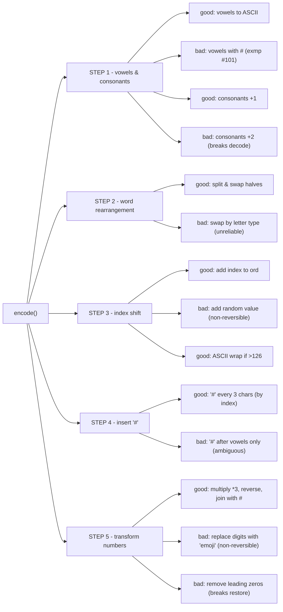

# STEP 1 - Replace vowels and shift consonants
```py
  # Instead of: char == "d" -> "e"
  # You encode: char == "d" -> "f"
```
- Ambiguitty: "f" might be original or result of shift
- Decoder has no context to subtract +2 correctly
- Colides with ASCII replacement vowel
 

# STEP 2 - Substring Rearrangement
```py
  # Instead of: "Python" -> "honPyt"
  # You separate vowels and consonants:
  #  - vowels = ['o'], consonants = ['P','y','t','h','n'] -> merged arbitrarily
```
- Completely original word order loses 
- Impossible to to reverse
-  Breaks mapping between 'encode' and 'decode' 


# STEP 3 - Index-Based Encoding
```py
  # For each character in the result string:
  # - Add its position index (starting from 0) to its ASCII value(?)
  # - Convert the resulting number back to a character(?)
```

- Confirm printable range safety
- Decide whether to wrap characters that exceed ASCII 126

# STEP 4 - Special Symbol Insertion
```py
  # - After every third character (?), insert a "#" (hash) char.
```

- Confirm if it should count letters only or all of characters
- Should it take/ignore digit groups "insiders"

# STEP 5 - Number Encoding
```python
  # Instead of: "123" -> "369" -> "9#6#3"
  # You encode: "1" -> "one", "2" -> "two", "3" -> "three"
```

- output length changes
- ireversible with no embedded dictionary
- collision with real words

